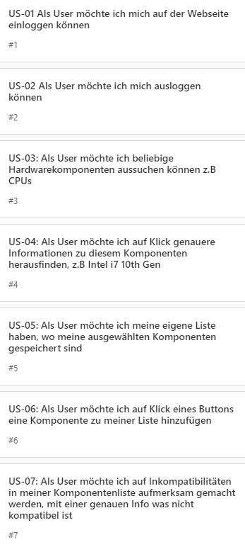
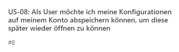
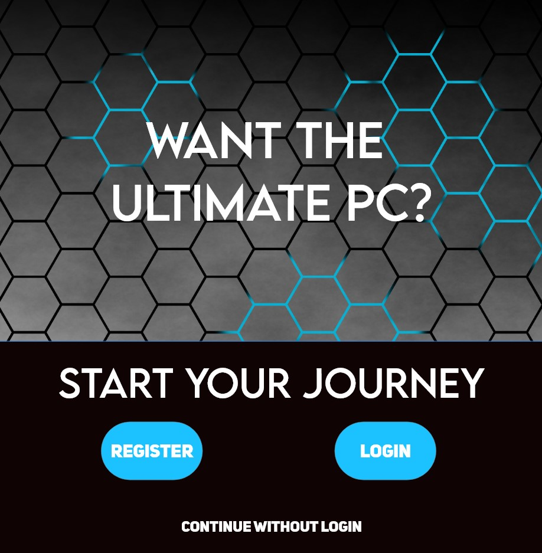
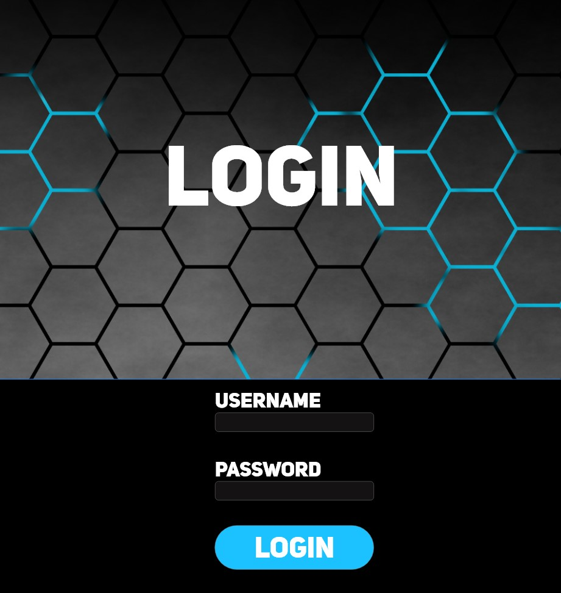
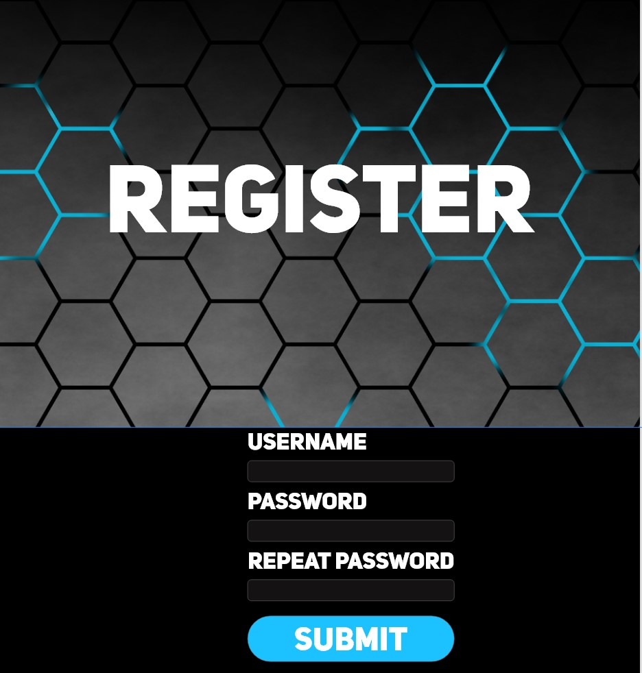
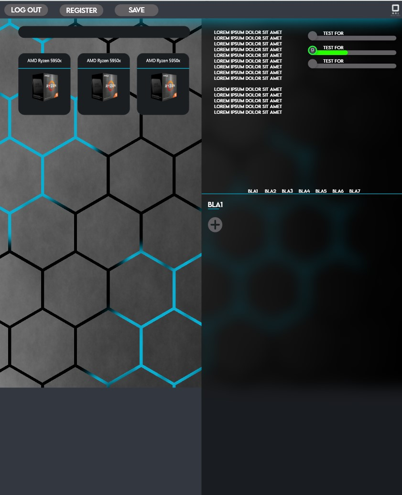
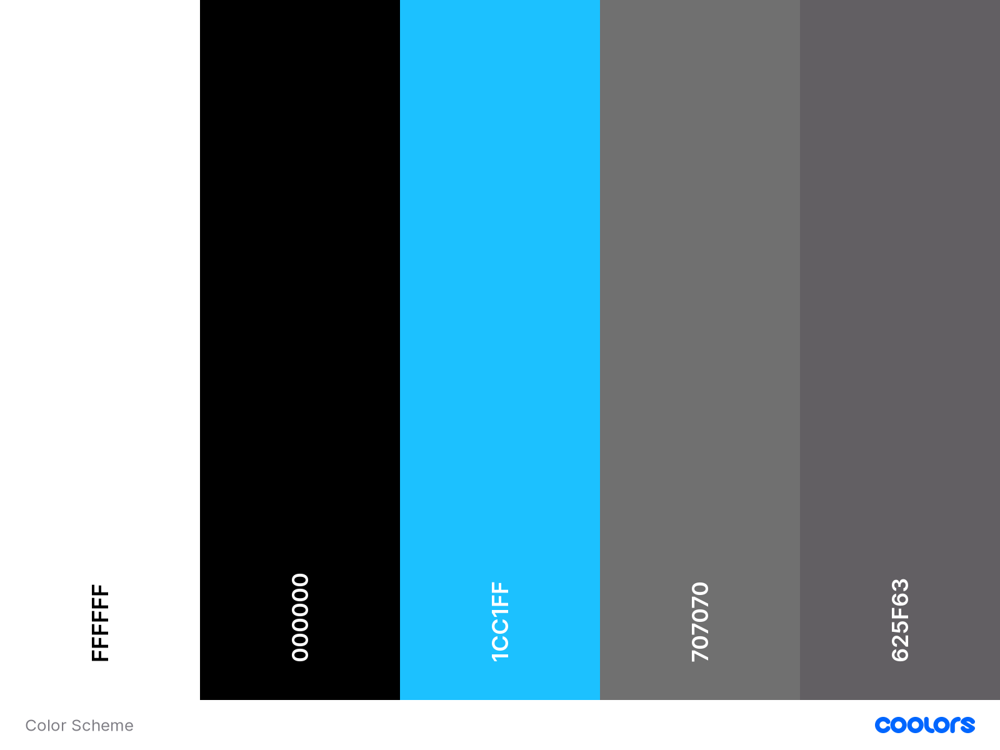
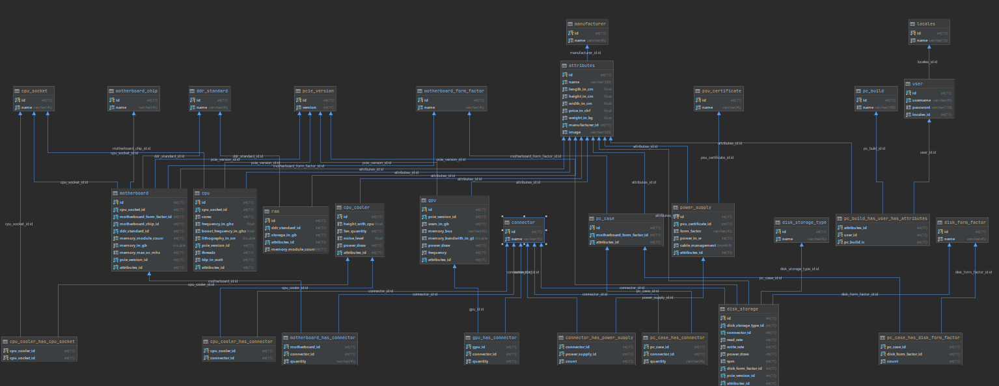

# MBL Hardware

## 1 Abstract

In diesem Projekt haben wir einen Hardwarekonfigurator programmiert.

Er achtet dabei auf alles Mögliche z.B. Sockel, Dimensionen usw.
So kann man sich viel Arbeit bei der PC-Konfiguration sparen.

Die Komponenten werden in einer Datenbank gespeichert sowie die selber abgespeicherten Konfigurationen. 
So kann man immer seine pro Konto abgespeicherten Konfigurationen ansehen.

## 2 Anforderungsanalyse

### 2.1 Zielgruppe
Grundsätzlich ist diese Webapp für jedermann gemacht,
der sich selber einen PC zusammenbauen möchte. Allerdings ist sie auf 15-35 Jährige ausgererichtet
, da Fachbegriffe wie z.B.
CPU, RAM oder PCIe ein gewisses Vorwissen benötigen. Die Webseite lässt sich leicht bedienen,
kein gewisses know-how nötig, um unsere Webseite zu bedienen. Man sollte jedoch in der Lage sein,
Sachen eingeben zu können und Handhabung mit der Maus haben.

Die Webseite wird auf Englisch sein, somit spricht es alle englischsprachige Regionen in der Welt an.

### 2.2 User Stories

Dies sind unsere Muss - Ziele. Diese sollten alle am Ende des Projekts umgesetzt sein.

Dies ist unser Kann - Ziel. Sobald wir alles fertig programmiert haben, versuchen wir dies auch noch umzusetzen.

##  3 GUI Design

### 3.1 Mockups

Dies ist die Homepage. Hier kann man entscheiden, ob man sich einloggen/registrieren möchte
oder diesen Schritt überspringen und gleich die Hardware konfigurieren möchte.

Hier kann man sich klassisch mit seinem Konto einloggen mit Benutzername und Passwort.

Falls man noch kein Konto erstellt hat, kann man auf dieser Seite ein Konto erstellen.
Auf dem Konto kann man seine Hardwarekonfigurationen abspeichern.

Hier besteht unsere Hauptseite. Man kann Komponenten ausuchen, 
Infos über diese auflisten lassen und Komponenten in einer eigenen Liste speichern.
Diese wird im Browser gecasht, damit man wieder Zugriff bei der nächsten Öffnung hat.

### 3.2 Farbkonzept

Die hellblaue Farbe wird für alle Buttons verwendet. Schwarz wird für den Hintergrund und für die Textfelder verwendet.
Weiss wird für die Texte verwendet. Und die beiden grauen Farben werden für den Navbar in der Hardwareconfigurationpage verwendet.

Die Webseite soll modern gestaltet sein mit Hilfe dieser Farben. Blau ist eine angenehme Farbe, die sehr gut zum Hintergrundbild passt.
Deswegen haben wir uns für diese Farbe entschieden.

Da Darkmode unter Benutzern vom Alter 15-35 meist bevorzugt wird, entschieden wir uns für den dunklen Hintergrund.

Wir verwenden gerademal 2 Schriftarten für die gesamte Seite und zwar Lemon Milk und Uni Sans.
Uni Sans wird für kleinere Texte verwendet, Lemon Milk für grössere Überschriften.

## 4 Datenhaltung

### 4.1 ERM

Hier ein vollständiges ERM von unserer DB. Sie beinhält alle nötigen Hardwarekomponente, die der Client benötigt.

Von dieser DB aus werden dann die Abfragen gemacht, um z.B. alle CPUs anzeigen zu lassen.

## 5 Technische Dokumentation

### 5.1 Code Style

- Tabellennamen in der DB immer klein geschrieben und in Einzahl
- React-Komponenten müssen immer gross geschrieben sein -> LoginComponent.js
- Alle Seiten sind je eine .js Datei. Diese beinhalten verschiedene React-Components
- Functional Components sind bevorzugt, Class Components müssen jedoch bei mehr Logik zum Einsatz gebracht werden
- Für das Routing im Frontend wird React-Router-Dom benötigt

### 5.2 Testauswertung

Alle Tests bis auf einen haben funktioniert.

Bei ST-06 hat die PC Konfiguration in einem von zwei Tests nicht ordnungsgemäss funktioniert.
Es gab Probleme wenn eine Komponente fehlte oder wenn man zu viele Komponenten ausgewählt hat.
In einem 2. Versuch lief jedoch alles Ordnungsgemäss.

### 5.3 Installationsanleitung

#### 5.3.1 Systemanforderungen

- Apache: 2.4.46
- PHP: 8.0.2
- HTML: 5
- CSS: 3
- Microsoft Edge: 89.0.774.45
- ReactJS: 17.0.1
- Node.js, npm: 15.4.0
- Material-UI: 4.11.3
- React-Router-DOM: 5.2.0

#### 5.3.2 Installation

Die Reactapp sollte auf einem Server deployt werden.
Dafür braucht es ein funktionierendes Node.js sowie npm installiert (https://nodejs.org/en/).

Sobald man dies hat, einfach in den Ordner navigieren (mit Terminal) und den Command "npm start" eingeben.
Nun sollte sich ein Fenster im Default-Browser öffnen mit der Webseite.

Jetzt fehlt noch der Backend und die DB. 
Für die DB einfach den SQL-Dump ausführen in einer Software wie Datagrip oder MySQL Workbench.
Dann sollte die DB schon laufen.

Für die API XAMPP installieren (am Besten in einem Docker Container ein Image pullen).
Dies sollte reichen. Einfach den Apache Server laufen lassen (Klick auf Start im Control Panel)
und nun hast du eine laufende MBL Software!

#### 5.3.3 Deployment

MBL Hardware ist aktuell nur lokal erreichbar.
Für das Deployment des Frontends einfach die Reactapp in einem Cloudserver hosten wie Netlify oder Heroku.

Bezüglich Backend die DB und den Server in einen Dockercontainer zusammenfassen und auf einem Server deployen.

## 6 Benutzerhandbuch

## 6.1 Pages
### 6.1.1 Landingpage
Auf der Landingpage kann man sich entweder registrieren, einloggen oder es auch überspringen.
### 6.1.2 Registrierung / Login

Auf der Registierungsseite kann man sich einen Account erstellen, welcher verwendet wird um PC Konfigurationen 
abzuspeichern. Falls man schon einen Account hat, kann man sich auf der Loginseite einloggen.

### 6.1.3 PC Konfigurator
Dies ist die Hauptseite des Projekts. Man kann rechts ein Hardwaretyp anklicken, worauf dann links verschiedene 
Komponenten von diesem Typ angezeigt werden. Diese kann man anklicken und zu einer PC Konfiguration hinzufügen.
Nachdem man seinen PC erstellt hat, kann man mithilfe des Verify PC Build Button überprüfen, ob die Hardware die man
ausgewählt hat, miteinander Kompatibel ist.

## 6.2 CRUD

Ursprünglich war geplant, dass man Sprachen aussuchen kann pro Benutzer.
Diese Sprachen können verändert werden, indem man z.B. die Sprache von Deutsch auf Englisch stellt (U von CRUD).

Das andere CRUD-Element wäre gewesen, dass man die Konfigurationen abspeichern kann auf dem Konto 
und diese auch wieder löschen (D und C von CRUD). 

Da wir aber leider keine Zeit mehr hatten, um diese Funktionen fertigzustellen,
konnten wir kein fertiges CRUD-Element haben.

Momentan kann man nur ein Konto erstellen (C von CRUD) und Daten rauslesen aus der DB (R von CRUD).

## 7 Fazit

Grundsätzlich ist das Projekt gut gelungen. 
Das Projekt hat zwar schwer angefangen, da wir allerlei Probleme hatten.
Jedoch jetzt gegen Ende lief es meistens sauber.

Wir alle hatten Probleme vorallem mit PHP, z.B. beim JSON parsen.
Auch React hat uns Probleme bereitet, da wir anfangs z.B. eine völlig falsche Struktur im Code hatten.

Jedoch konnten wir trotzdem ein einigermassen stabiles Projekt fertigstellen.
Zwar haben wir mehr geplant und weniger davon erreicht.
Trotzdem sind wir alle mit dem Endergebnis zufrieden und wir alle wissen,
dass wir PHP nicht mögen. Wir konnten besser im Team arbeiten wie beim letzten Projekt,
da wir nichts drauflos geplant haben und sehr viel miteinander abgesprochen haben.
So hatten wir von Anfang an eine klare Idee, wer was machen muss.

Wir haben viel gelernt, dabei herausstechen tut vorallem der Fakt, dass wir uns überschätzt haben.
Zwar hätten wir das Projekt locker fertigstellen können, aber nicht in der vorgegebenen Zeit.
Es war einfach zu knapp für uns, um alle Funktionen zu implementieren.

Fürs nächste Projekt werden wir ein wenig realistischer denken müssen und erst 
weitere Ziele ergänzen, wenn die Bestehenden auch funktionieren.

Was noch fehlt, ist die vollständige Validierung der Komponenten sowie 
das Abspeichern der Konfigurationen. Auch das Suchfeld funktioniert nicht.

Ansonsten hat alles geklappt und ist funktionsbereit.